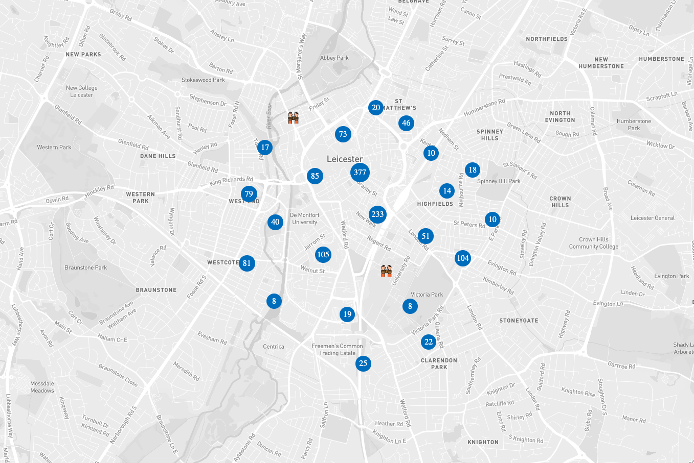

## Getting Started with Mapbox

- Node Packages used for this project:
    - react-map-gl
    - swr
    - use-supercluster

Data Resource: https://data.police.uk

Run the above project with following Commands:

- `npm i`
- `npm start`

Now, the app runs on `http://localhost:3000`

#### Demo

